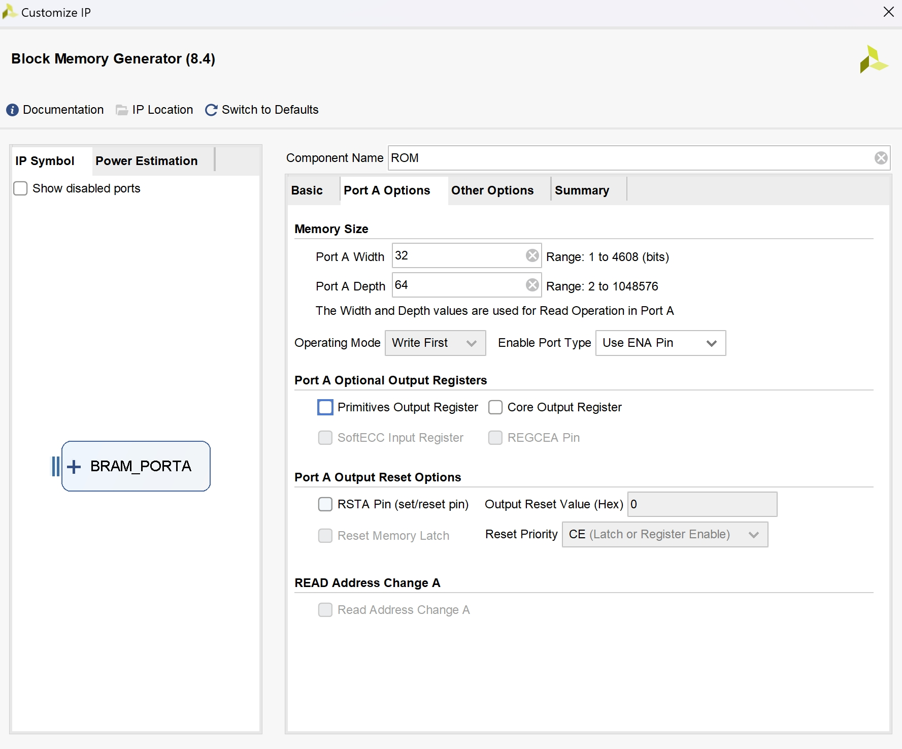
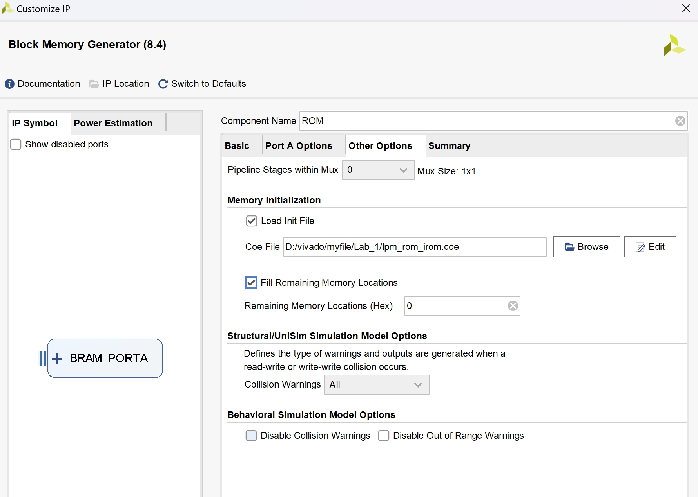
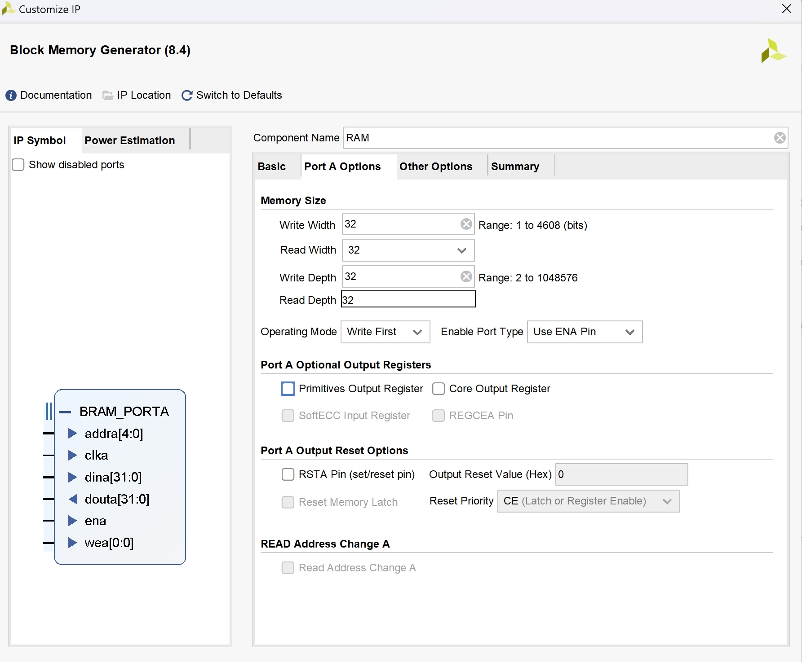

# <center> Lab 1 报告 </center>

## 1. ALU 设计实验  

设计代码如下：

```verilog
// alu.v
module alu (a,b,aluc,s,z);
   input [31:0] a,b;
   input [3:0] aluc;
   output [31:0] s;
   output        z;
   wire z;
   wire [31:0] s;
   assign  s = (aluc == 4'b0000)? a + b: 
               (aluc == 4'b1000)? a - b:
               (aluc == 4'b0111)? a & b:
               (aluc == 4'b0110)? a | b:
               (aluc == 4'b0100)? a ^ b:
               (aluc == 4'b0010)? b    :
               (aluc == 4'b0001)? a <<< b:
               (aluc == 4'b0101)? a >> b: // logical
               (aluc == 4'b1101)? $signed($signed(a) >>> b): // arithmetic
               0;
  assign z = (s == 0); 
endmodule
```

```verilog
// alu_test_top.v
module alu_test_top(
    input sys_rst_n, //globle reset,active low, 
    input sys_clk_in, //board system clock,100MHz
    input [4:0] sw_pin,//sw_pin4 to sw_pin0
    input [4:0] dip_pin,//dip_pin4 to dip_pin0
    output [7:0] seg_data_0_pin, //output DP1,G1,F1,E1,D1,C1,B1,A1, left
    output [7:0] seg_data_1_pin, //output DP0,G0,F0,E0,D0,C0,B0,A0,  right
    output [7:0] seg_cs_pin, //DN1_K4,DN1_K3,DN1_K2,DN1_K0,DN0_K4,DN0_K3,DN0_K2,DN0_K1 left to right
    output [0:15] led_pin
     );

wire clock_1s,zero;
wire [31:0] aluout;
wire[31:0] alub = {27'b0,sw_pin[4:0]};
wire [3:0] aluc = dip_pin[3:0]; 

//例化alu
alu alu(
    .a(32'h80000005), // 为了测试逻辑右移与算数右移，将首位改为1
    .b(alub),
    .aluc(aluc),
    .s(aluout),
    .z(zero)
);

//例化display
display display(
  .clk(sys_clk_in),
  .reset(sys_rst_n),
  .s(aluout),
  .seg0(seg_data_0_pin),
  .seg1(seg_data_1_pin),
  .ans(seg_cs_pin)
    );

endmodule
```

烧录后进行测试，以下展示了部分指令：

**指令0000 A+B：**


**指令1000 A <<< B：**


**指令0111 A >> B（逻辑右移）：**


**指令1101 A>>B（算数右移）：**


其余指令经过测试都能正常运行。


## 2. IP 实例化 

### 2.1 使用 Block Memory Generator 例化了一个32位宽， 64单元的单端口指令ROM，并加载了指令 coe 文件






### 2.2 例化一个32位宽， 32单元的单端口数据RAM，存放CPU数据  
