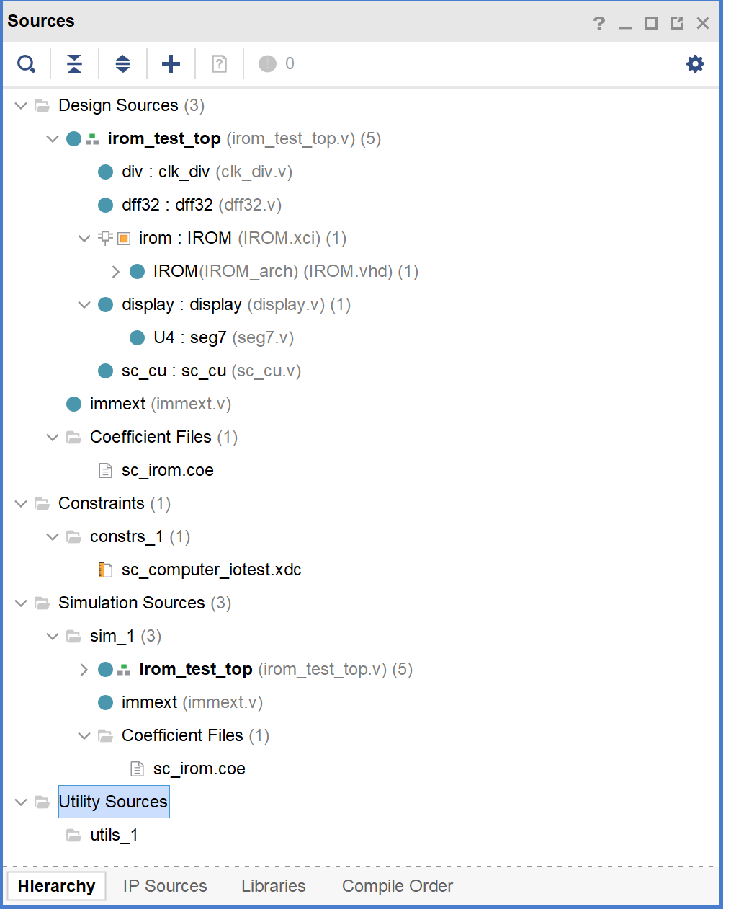
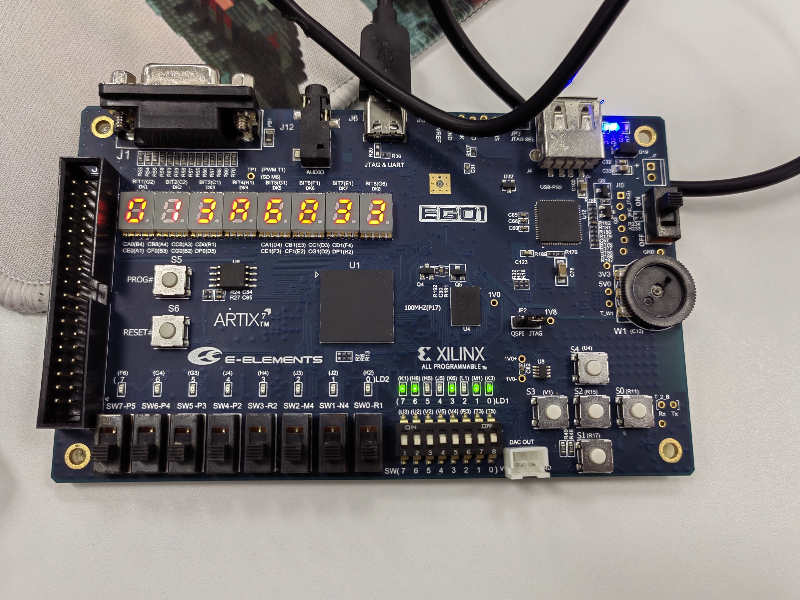
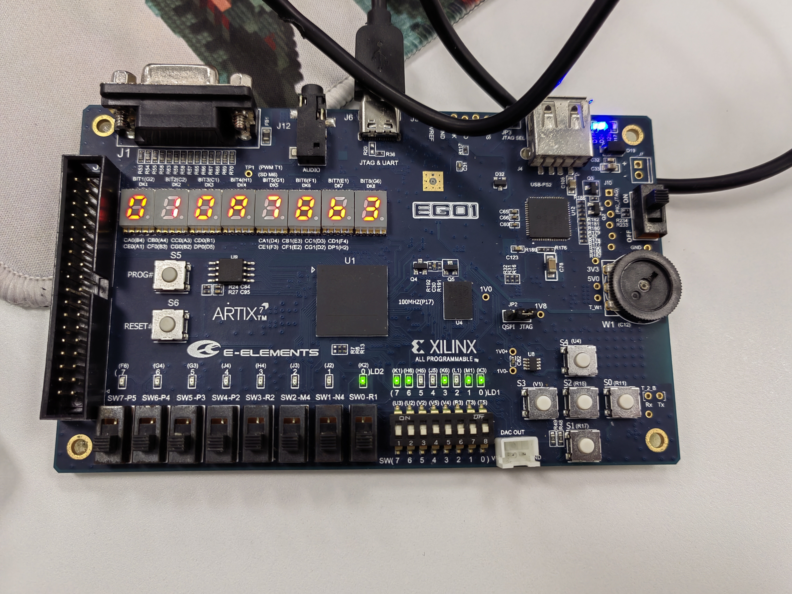
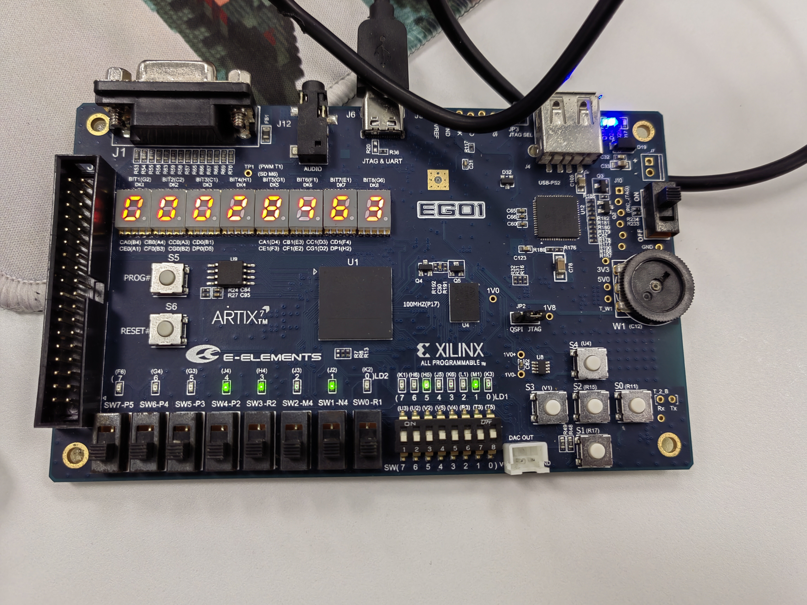
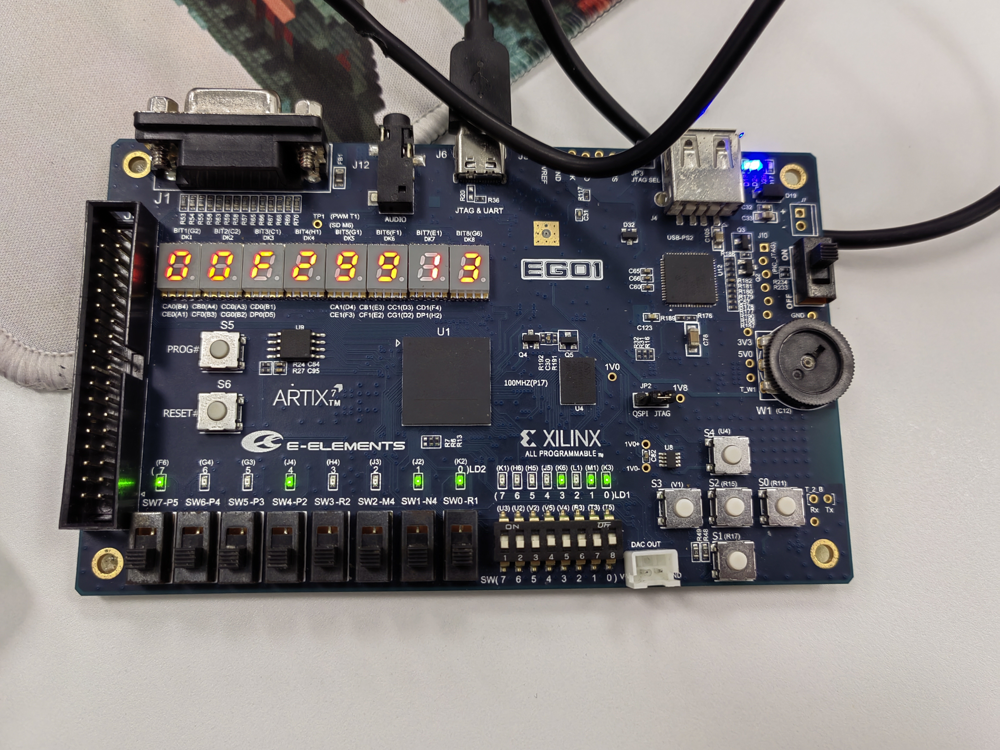

# <center> Lab 2 报告 </center>

### 控制器代码
```
module sc_cu (inst, z, wmem, wreg,  m2reg, aluc, 
              aluimm, pcsource, sext,i_lui,i_sw,shift);
   input  [31:0] inst;
   input        z;
   output       wreg,m2reg,aluimm,sext,wmem,i_lui,i_sw,shift;
   output [3:0] aluc;
   output [1:0] pcsource;
   wire [6:0] op = inst[6:0];
   wire [2:0] func3 = inst[14:12];
   wire [6:0] func7 = inst[31:25];
   
   wire r_type = (op == 7'b0110011);
   wire i_type = (op == 7'b0010011);
   //R type
   wire i_add = r_type &  (func3 == 3'b000 ) & ~inst[30];           //000，0
   wire i_sub = r_type &  (func3 == 3'b000 )& inst[30];             //000，1
      


   //  please complete the deleted code.
   
   
   wire i_and = r_type & (func3 == 3'b111 );          //111
   wire i_or  = r_type & (func3 == 3'b110 );          //110
   wire i_xor = r_type & (func3 == 3'b100 );          //100
   wire i_sll = r_type & (func3 == 3'b001 );          //001
   wire i_srl = r_type & (func3 == 3'b101 ) & ~inst[30];          //101,0
   wire i_sra = r_type & (func3 == 3'b101 ) &  inst[30];          //101,1

   //I type
   wire i_addi = i_type & (func3 == 3'b000 );          //000
   wire i_andi = i_type & (func3 == 3'b111 );          //111
   wire i_ori  = i_type & (func3 == 3'b110 );          //110      
   wire i_xori = i_type & (func3 == 3'b100 );          //100
   wire i_slli = i_type & (func3 == 3'b001 );          //001
   wire i_srli = i_type & (func3 == 3'b101 ) & ~inst[30];          //101,0
   wire i_srai = i_type & (func3 == 3'b101 ) &  inst[30];          //101,1

   wire i_lw   = (op == 7'b0000011);
   wire i_jalr = (op == 7'b1100111);     

   //S type
   wire i_sw   = (op == 7'b0100011) & (func3 == 3'b010);
   //SB type 
   wire i_beq  = (op == 7'b1100011) & (func3 == 3'b000);
   wire i_bne  = (op == 7'b1100011) & (func3 == 3'b001);
   //U type 
   wire i_lui  =  (op == 7'b0110111);
   //UJ type
   wire i_jal  =  (op == 7'b1101111);  
  
   assign pcsource[1] = i_jalr | i_jal;
   assign pcsource[0] = ( i_beq & z ) | (i_bne & ~z) | i_jal ;
   
   assign wreg = i_add | i_sub | i_and | i_or   | i_xor  |
                 i_sll | i_srl | i_sra | i_addi | i_andi |
                 i_ori | i_xori | i_srli | i_slli | i_srai | i_lw | i_jalr | i_lui  | i_jal;
   
 
   assign aluc[3] = i_sub | i_sra | i_srai | i_beq | i_bne;
   assign aluc[2] = i_and | i_or | i_xor | i_srl | i_sra | i_andi |
                    i_ori | i_xori | i_srli | i_srai; 
   assign aluc[1] = i_and | i_or | i_andi | i_ori | i_lui;
   assign aluc[0] = i_and | i_sll | i_srl | i_sra | i_andi | i_slli | i_srai;
  
   assign aluimm  = i_addi | i_andi | i_ori | i_xori | i_slli | i_srli | i_srai | i_lw | i_jalr |
                    i_sw | i_beq | i_bne | i_lui | i_jal;
   assign sext    = i_addi | i_lw | i_jalr | i_sw | i_beq | i_bne | i_jal | i_andi |i_ori |i_xori |i_slli |i_srli |i_srai; //add itype
   assign wmem    = i_sw;
   assign m2reg   = i_lw;
   assign shift   = i_sll | i_srl | i_sra | i_slli | i_srli | i_srai;
   endmodule
```

### 立即数模块代码

```
`timescale 1ns / 1ps
//////////////////////////////////////////////////////////////////////////////////
// Company: 
// Engineer: 
// 
// Create Date: 2024/04/20 16:00:35
// Design Name: 
// Module Name: immext
// Project Name: 
// Target Devices: 
// Tool Versions: 
// Description: 
// 
// Dependencies: 
// 
// Revision:
// Revision 0.01 - File Created
// Additional Comments:
// 
//////////////////////////////////////////////////////////////////////////////////


module immext(inst,pcsource,sext,i_lui,i_sw,shift,out_immediate);
    input [31:0] inst;
    input sext,i_lui,i_sw,shift;
    input [1:0] pcsource;
    output [31:0] out_immediate;

    wire e = sext & inst[31];
        
    wire [31:0] shift_imm, sw_imm, branchpc_offset, jalpc_offset, itype_imm, lui_imm;
    
    assign shift_imm = {27'b0,inst[24:20]};
    assign sw_imm = {{20{inst[31]}},inst[31:25],inst[11:7]};
    assign branchpc_offset = {{19{e}},inst[31], inst[7],inst[30:25],inst[11:8],1'b0};
    assign jalpc_offset = {{12{inst[31]}},inst[19:12],inst[20],inst[30:21],1'b0};
    assign itype_imm = {{20{e}},inst[31:20]};
    assign lui_imm = {inst[31:12],12'b0};

    assign out_immediate = i_lui ?  lui_imm:
                          shift ?  shift_imm:
                          i_sw  ?  sw_imm:
                        (pcsource == 2'b01)  ?  branchpc_offset:
                        (pcsource == 2'b11)  ?  jalpc_offset:
                        itype_imm;
endmodule
```

### vivado工程文件截图




### 板级测试照片








